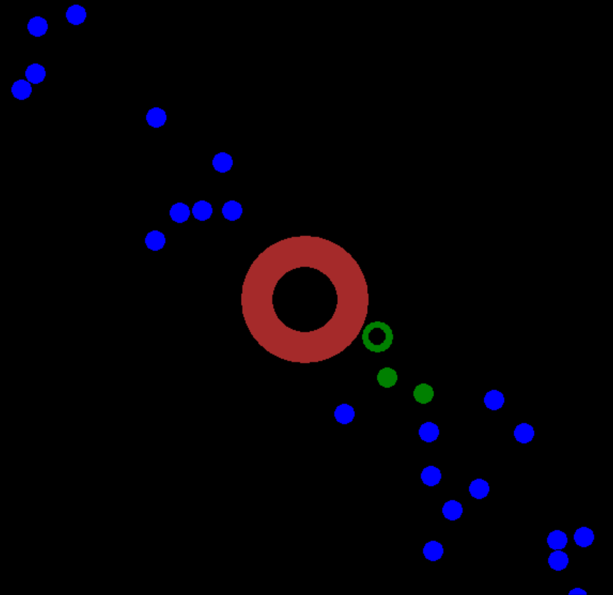

# ColoringBall
this game made by tkinter in Python.

# DEMO
<br />
figure. Playing Image
 
# How to Play
To clear the game, you only click.<br />
One click makes "Charge".<br />
When that finger is off a mouse, the center ball launch!!<br />
Then that and other balls have a collision, other balls, blue balls change its color to green.<br />
When you achive to change all blue balls to green balls, you clear the game!!
 
# Requirement
* Python 3
* tkinter
 
# Usage
 
```bash
git clone https://github.com/hino581/ColoringBall.git
cd ColoringBall
python game.py
```
 
# Note
 
Message appears with Japanese.
 
# Author
 
* hino
* college student
* sd18070@toyota-ti.ac.jp
